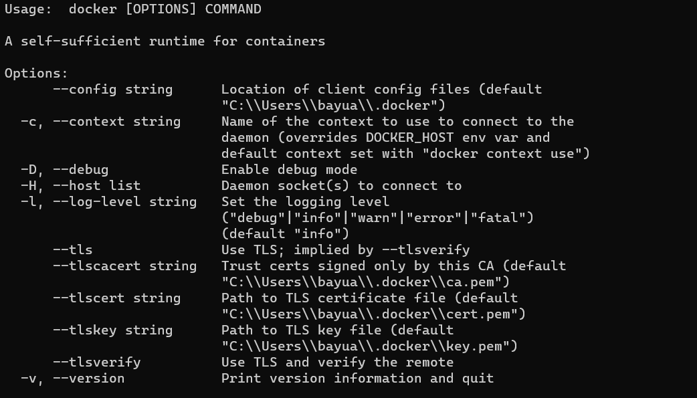
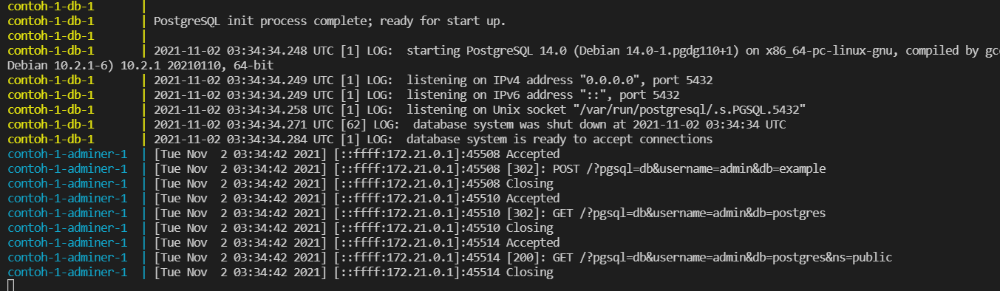
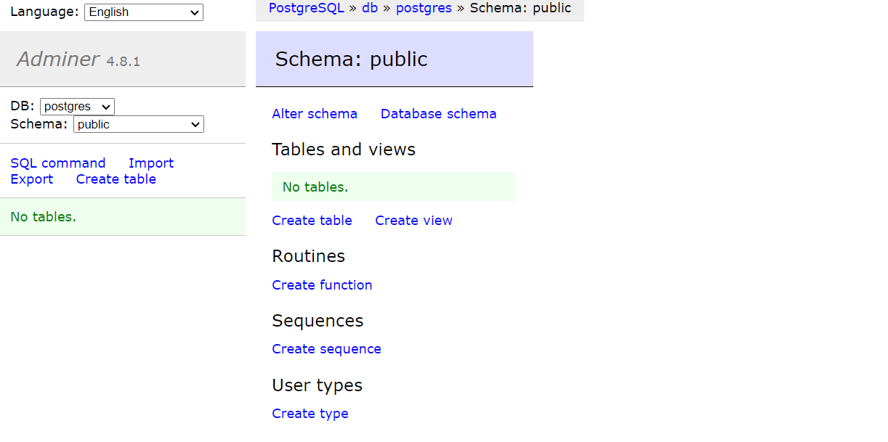
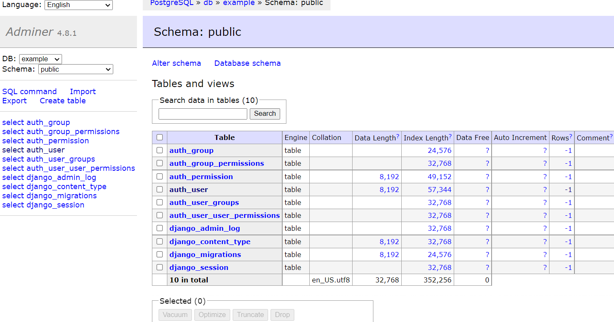
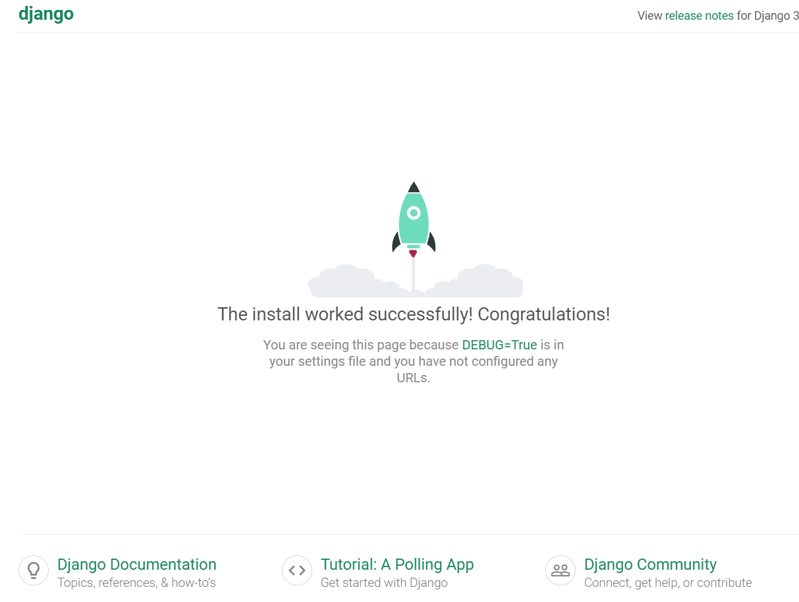

# Pengenalan Docker 


<p>Docker sendiri dikembangkan oleh google menggunakan bahasa pemrograman go(lang) dan sudah di rilis sejak tahun 2013 atau 8 tahun yang lalu</p>

<p>Docker adalah aplikasi untuk menyatukan berbagai file software dan pendukungnya dalam sebuah wadah (container) agar memudahkan proses pengembangan software. Docker dengan containernya docker mampu menggantikan peran Virtual Machine</p>


<p>Dapat dilihat sekilas pada gambar diatas, untuk VM (sebelah kiri) menggunakan Hypervisor dan perlu menginstall OS sendiri agar bisa dipakai untuk menjalankan aplikasinya. Sedangkan pada docker, docker engine menggunakan kernel dari OS untuk kontainerisasi aplikasi-aplikasinya sehingga memakan lebih sedikit memory dibandingkan VM yang memerlukan OS</p>

## Docker Untuk Development
<p>Untuk development kita tidak perlu untuk memahami docker secara mendalam. Yang perlu kita siapkan sebelum memulai development di mesin lokal (laptop/desktop) adalah: </p>

- [Docker Engine](https://docs.docker.com/get-docker "Link download docker") (Untuk windows wajib windows 10 dan install wsl2).
- [Docker Compose](https://docs.docker.com/compose/install/, "Link download docker compose") (Untuk windows biasanya sudah terinstall bersama docker desktop).

Untuk memastikan docker terinstall dapat di cek melalui terminal/console dengan menjalankan perintah `docker` maka akan keluar list bantuan. Begitu juga untuk `docker-compose`


### Aplikasi sederhana

Setelah docker-compose kita bisa membuka teks editor (VSCODE paling mantap). Pada contoh disini, kita membuat folder `contoh-1/` untuk membuat konfigurasi `docker-compose.yml`. Isi dari file tadi adalah seperti dibawah ini. 

```yaml
# contoh-1\docker-compose.yml

version: "3.0"

services:
  db:
    image: postgres:14.0
    environment:
      - POSTGRES_USER=admin
      - POSTGRES_PASSWORD=123
    volumes:
      - ./data:/var/lib/postgresql/data

  adminer:
    image: adminer
    ports:
      - 8080:8080
```

Penjelasan dari file diatas, pada baris pertama kita perlu mendefinisikan versi dari docker compose kita, disarankan untuk menggunakan versi diatas 3.0.   
Kemudian pada bagian services, kita menjabarkan aplikasi/container yang mau kita jalankan. disini kita mendefinisikan dua aplikasi yaitu `db` dan `adminer`. Container db bertugas untuk menjalankan image postgres versi 14.0 dengan user admin dan password 123. Untuk mencegah data kita hilang, maka pada bagian `volumes` data postgresql kita simpan pada local machine pada direktori `./data`. `adminer` adalah database viewer sederhana, yang dapat diakses melalui http://localhost:8080 sesuai yang sudah kita atur pada bagian `ports`.       

Untuk menjalankan konfigurasi diatas, arahkan terminal pada direktori contoh-1, kemudian jalankan perintah `docker-compose up` tunggu hingga selesai.



Buka browser dan http://localhost:8080, pilih koneksi ke postgresql, gunakan user `admin` dan password `123` untuk bagian database secara default adalah `postgres`. Maka kita akan masuk ke halaman dashobard adminer 


Sampai disini kita berhasil menjalankan Aplikasi Sederhana Kita.

## Aplikasi Dengan Source Code
Sebelum memulai pastikan container pada contoh-1 sudah dihentikan

Tentunya ketika mengembangkan aplikasi kita wajib menambahkan/edit/hapus baris kodingan sesuai kebutuhan. 
Pada contoh kali ini, kita akan membuat aplikasi django.
Direktori `contoh-2` sudah terinstall django. Mari kita lihat modifikasi apa saja yang perlu dilakukan.

Yang pertama adalah file `docker-compose`, jika dibandingkan dengan `contoh-1` kita menambahkan container `web`. Pada bagian `build` adalah lokasi dimana kita menaruh `Dockerfile`. `depends_on` menunjukkan container mana yang harus dijalankan terlebih dahulu, disini `web` menunggu `db`. `command` disini adalah perintah yang dijalankan pertamakali oleh kontainer ketika diaktifkan.

```yaml
# contoh-2/docker-compose.yml

version: "3.0"

services:
  web:
    build: .
    depends_on:
      - db
    volumes:
      - .:/code
    ports:
      - "8000:8000"
    command: python manage.py runserver 0.0.0.0:8000
  db:
    image: postgres:14.0
    volumes:
      - ./data:/var/lib/postgresql/data
    environment:
      - POSTGRES_DB=example
      - POSTGRES_USER=admin
      - POSTGRES_PASSWORD=123

  adminer:
    image: adminer
    ports:
      - 8080:8080
    
```

Kemudian kita buat file Dockerfile yang bertujuan untuk melakukan kostumisasi image yang akan kita pakai. Dalam kasus ini kita install dependency pada `requirements.txt`. Dan menjalankan migrasi ke database.

```dockerfile
# contoh-2/Dockerfile
FROM python:3.9
ENV PYTHONUNBUFFERED=1

USER root

WORKDIR /code
COPY requirements.txt /code/
RUN pip install -r requirements.txt
COPY . /code/
RUN python3 manage.py makemigrations
RUN python3 manage.py migrate
```

File requirements.txt

```txt
Django==3.0.14
psycopg2==2.8.6
```

Kemudian pada file django, kita modifikasi file `settings.py` bagian database untuk menghubungkan dengan PostgreSQL

```python
# docker_example/settings.py
...
DATABASES = {
    'default': {
        'ENGINE': 'django.db.backends.postgresql_psycopg2',
        'NAME': 'example',
        'HOST': 'db',
        'PORT': 5432,
        'USER': 'admin',
        'PASSWORD': '123',
    }
...
}
```
Setelah langkah diatas selesai, jalankan perintah build
```shell
docker-compose build
```
Tunggu hingga selesai dan jalankan aplikasi kita
```shell
docker-compose up
```
Jika kita membuka `adminer` http://localhost:8080 maka akan terlihat table dari django sudah terinstall   

Kemudian buka http://localhost:8000 untuk melihat aplikasi django kita berjalan dengan normal   



## Link Terkait
- https://www.niagahoster.co.id/blog/docker-tutorial/
- https://iqbalsyamilayas.medium.com/docker-compose-untuk-mempercepat-pengembangan-aplikasi-kontainer-ed8cf8f16bab
  